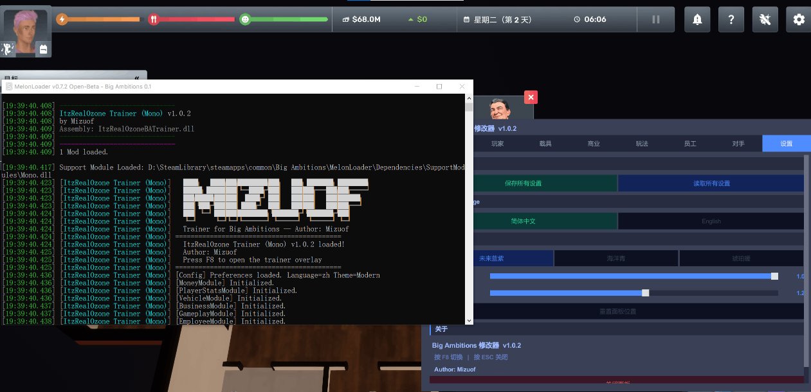

# ItzRealOzone Trainer — Big Ambitions 多功能修改器

Big Ambitions (Hovgaard Games) 的 MelonLoader Mod —  雄心壮志1.0版本内置修改模组，按 **F8** 打开。



## 安装方法

### 1. 安装 MelonLoader

下载 MelonLoader.Installer：

[MelonLoader.Installer.exe 下载](https://github.com/LavaGang/MelonLoader/releases)

> 或用浏览器打开 [Release 页面](https://github.com/LavaGang/MelonLoader/releases) 自行选择版本。

打开 MelonLoader.Installer，按以下步骤操作：

1. 在列表中找到 **Big Ambitions**（或手动选择游戏 exe）
2. **Install**（项目开发环境为 **v0.7.2**，Mono net35 运行时）
3. 安装完成后，**运行一次游戏**，务必进入游戏主界面再退出（首次运行会生成必要文件）
4. 游戏根目录出现 `MelonLoader/` 和 `Mods/` 文件夹即安装成功

> **如果控制台报错或安装失败**：卸载后尝试降低 MelonLoader 版本（例如 v0.7.1）。

### 2. 安装 Mod

将 `ItzRealOzoneBATrainer.dll` 放入游戏根目录的 `Mods/` 文件夹。

### 3. 启动

启动游戏，进入主界面后按下 **F8** 打开修改面板。

## Steam 游戏根目录快速定位

Steam 库 → 右键 **Big Ambitions** → 管理 → 浏览本地文件。

## 快捷键

| 按键 | 功能 |
|------|------|
| **F8** | 打开/关闭修改面板 |
| **ESC** | 关闭面板 / 退出输入框 |

## 功能面板

| Tab | 功能 |
|---|---|
| **资金** | 快捷加钱 ($1K~$1M)，自定义金额 (加/设)，税率 / 物价 / 出口倍率 |
| **玩家** | 填满需求，体力滑条+快捷 (25/50/75/100)，心情/饱食±，移速 (走/慢跑/奔/滑板车)，衰减开关，年龄±，完成个人目标 |
| **载具** | 损坏/油耗开关，维修/加油/清洗/清罚单，拖车到加油站/维修厂 |
| **商业** | 最大化满意度，解锁课程/联系人/进口限制/进口商品，促销/薪资/利率/对手难度倍率 |
| **玩法** | 游戏速度 (暂停~10x)，跳天，设时间 (快捷+自定义)，交通/无敌/教程，任务/目标/联系人，进口交货 (付费/免费)，存档 |
| **员工** | 批量满意，薪资倍率 (免费/0.5x/1x/2x)，设薪资，8 类招聘候选人 (客服/清洁/律师/采购/物流/配送/程序员/人事) |
| **对手** | 刷新/击败全部，难度预设 (简单/正常/困难/残酷) |
| **设置** | 保存/读取设置，**语言切换 (中文/English)**，**蓝科技主题 + 13 项控件颜色自定义**，透明度/缩放，重置位置，关闭 |

## 界面定制

- **语言**：全部文案中英双语词典化（`Loc`）

## 游戏技术栈

| 技术 | 用途 |
|------|------|
| **Unity 2022.3.62f2** | 游戏引擎（MonoBleedingEdge 后端） |
| **MelonLoader v0.7.x** | Mod 加载器（net35 运行时） |
| **Big Ambitions.dll** | 游戏主逻辑程序集 |
| **HGExtensions** | 提供 `InstanceBehavior<T>` 单例基类 |

## 构建

```bash
dotnet build -c Release
```

输出：`bin/Release/ItzRealOzoneBATrainer.dll`

需要 .NET SDK 8/10（目标 `netstandard2.1`）+ 游戏引用（`MelonLoader/net35/MelonLoader.dll`、`Big Ambitions_Data/Managed/*.dll`）。在 `BigAmbitionsTrainer.csproj` 中通过 `GameDir` 属性指定游戏安装根目录。

## 模块列表

| 文件 | 功能 |
|------|------|
| `ItzRealOzoneBATrainerMod.cs` | 主入口 + F8 调色 + MIZUOF banner |
| `BigAmbitionsTrainer.UI\TrainerOverlay.cs` | F8 悬浮面板 (8 Tab)，拖动/缩放/透明度/主题 |
| `BigAmbitionsTrainer.UI\TrainerTheme.cs` | 蓝科技主题 + 13 项控件颜色自定义 |
| `BigAmbitionsTrainer.UI\ToastNotification.cs` | IMGUI Toast 提示 |
| `BigAmbitionsTrainer.L\Loc.cs` | 中英双语本地化词典 |
| `BigAmbitionsTrainer.Config\TrainerConfig.cs` | MelonPreferences 配置管理 |
| `BigAmbitionsTrainer.Modules\MoneyModule.cs` | 资金/经济修改 |
| `BigAmbitionsTrainer.Modules\PlayerStatsModule.cs` | 玩家需求/速度/年龄/目标 |
| `BigAmbitionsTrainer.Modules\VehicleModule.cs` | 载具维修/加油/拖车 |
| `BigAmbitionsTrainer.Modules\BusinessModule.cs` | 商业满意度/解锁/倍率 |
| `BigAmbitionsTrainer.Modules\GameplayModule.cs` | 游戏速度/时间/交通/任务/交货 |
| `BigAmbitionsTrainer.Modules\EmployeeModule.cs` | 员工管理/招聘 |
| `BigAmbitionsTrainer.Modules\RivalsModule.cs` | 对手管理 |
| `BigAmbitionsTrainer.Modules\WorldModule.cs` | 世界/时间读取 |
| `BigAmbitionsTrainer.Modules\UndoSystem.cs` | 撤销系统 (预留) |
| `BigAmbitionsTrainer.Modules\GameRef.cs` | 单例获取辅助 |

---

**作者**: Mizuof  
**GitHub**: https://github.com/Mizuof 

*本修改器完全免费，请勿用于商业用途。*
